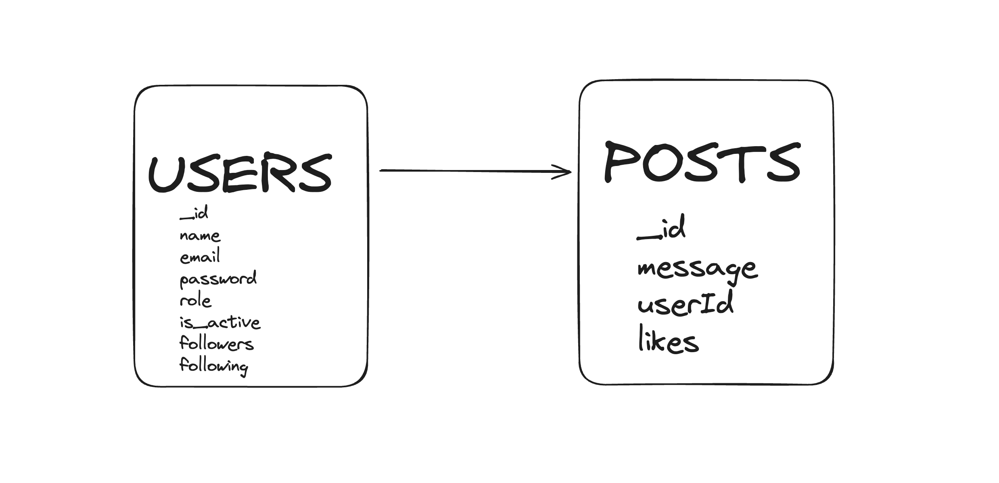

# Social Media API Project ❤️

Welcome to my second backend project using various technologies and libraries!


<br>

  <summary> Table of contents 📝</summary>
  <ol>
    <li><a href="#about-the-project">About the project</a></li>
    <li><a href="#deploy-🚀">Deploy</a></li>
    <li><a href="#stack">Stack</a></li>
    <li><a href="#er-diagram-from-sql">Database Diagram</a></li>
    <li><a href="#clond">Clone</a></li>
    <li><a href="#endpoints">Endpoints</a></li>
    <li><a href="#future-functionalities">Future functionalities</a></li>
    <li><a href="#contributions">Contributions</a></li>
    <li><a href="#development">Development</a></li>
    <li><a href="#appreciations">Appreciations</a></li>
    <li><a href="#contact">Contact</a></li>
  </ol>

## About the project

The main idea of this project is to create a new social media which has users, posts, comments, follows and likes. It uses non-relational database (in our case MongoDB + mongoose library) for data storage. 

The web app has various functionalities for users such as register, login, check profile, amend profile, create posts , update posts, delete post, find a specific post, see all my posts as well as other users posts, like other posts or dislike them and follow/unfollow other users. There are few more functionalities implemented only for admins and super admins of the page. We also have seeders(used to insert data faster in our database in case of refresh) and middlewares(used for authentication methods such as tokens).

The project is developed and now it was deployed to production.
<br> More functionalities coming veeeery soon! :)

## Deploy 🚀

<div align="center">
    <a href="https://tattoo-studio.zeabur.app/"><strong> Coming soon! </strong></a>🚀🚀🚀
</div>

## Stack

Used technologies for the project:

<div align="center">
<a href="https://www.expressjs.com/">
    
</a>
<a href="https://nodejs.org/es/">
    
</a>
<a href="https://developer.mozilla.org/es/docs/Web/JavaScript">
    
</a>
<a href="">
    
</a>
<a href="">

</a>
<a href="">
    
</a>
<a href="">
    
</a>
 </div>

## ER Diagram from SQL



- 1 Strong entitiy - Users (can exist by itself without depending on another entitiy).
- 1 Weak entitiy - Posts (depends on users, it must be written/posted by a user).
<br>

Even that we have a non relational database project, there is a relation between
the posts and users as a post cannot exist by itself. A post can have likes such as user can have followers and followings.

## Local installation option

1. Clone the repository from the url
2. `$ npm install`
3. Connect the cloned repo with our Database
4. `$ Execute the migrations`
5. `$ Execute the seeders`
6. `$ npm run dev` to elevate our server
7. ...

## Endpoints

<details>
<summary>Users</summary>

- REGISTER 🔑

          POST http://localhost:5001/api/users/register

    body:

    ```js
        {
            "email": "name@mail.com",
            "password": "123456789"
        }
    ```

<br>

- LOGIN 🔓	

          POST http://localhost:5001/api/users/login

    body:

    ```js
        {
            "email": "name@mail.com",
            "password": "123456789"
        }
    ```
<br>

- GET ALL USERS 🔎 (only admin)

          GET http://localhost:5001/api/users/all

    auth:

    ```js
        your token
    ```

<br>

- GET USER PROFILE 🗂

          GET http://localhost:5001/api/users/profile

    auth:

    ```js
        your token
    ```

<br>

- UPDATE USER PROFILE ⚙️

          PUT http://localhost:4000/api/users/profile/update

    body:

    ```js
        {
        "email": "newemail@mail.com"
        }
    ```

    auth:

    ```js
        your token
    ```
<br>

- GET USER BY EMAIL 🪪 (only admin)

          GET http://localhost:5001/api/users/email

    body:

    ```js
        {
            "email": "example@mail.com"
        }
    ```

    auth:

    ```js
        your token
    ```
<br>


- DELETE USER 🪪  (only admin)

          DELETE http://localhost:5001/api/users/:id

    body:

    ```js
        {
            "id": 3     (the id of the user we want to delete)
        }
    ```

    auth:

    ```js
        your token
    ```

<br>

- CHANGE USER ROLE BY ID 🗂 (only admin)

          PUT http://localhost:5001/api/users/role

    auth:

    ```js
        your token
    ```
    body:

    ```js
        {
            "id" : 1 (this is the id of the user we will update)
            "role_id": 3     (the new role_id for our user goes here)
        }
    ```

</details>

<details>
<summary>Posts</summary>

- CREATE POST ☎️

          POST http://localhost:5001/api/posts/create

    body:

    ```js
        {
        "message": "your message here"
        }
    ```

    auth:

    ```js
        your token
    ```

<br>

- DELETE POST BY ID ☎️

          DELETE http://localhost:5001/api/posts/delete/:id

    auth:

    ```js
        your token
    ```

<br>

- UPDATE POST ☎️

          PUT http://localhost:4000/api/appointments/change

    body:

    ```js
        {
        "id": 3           (the id of the post to update)
        "message": "newinfo"       (the new info)
        }
    ```

    auth:

    ```js
        your token
    ```

<br>

- GET USER POSTS ☎️

          GET http://localhost:5001/api/posts/own

    auth:

    ```js
        your token
    ```


<br>

- GET ALL POSTS ☎️ (admin only)

          GET http://localhost:5001/api/posts/all

    auth:

    ```js
        your token
    ```

<br>

- GET POST BY ID ☎️

          GET http://localhost:5001/api/posts/:id

    auth:

    ```js
        your token
    ```

    body:

    ```js
        {
        "id": 3           (the id of the post wanted)
        }
    ```
<br>

- GET USER POSTS BY USER ID ☎️

          GET http://localhost:5001/api/posts/user/:id

    auth:

    ```js
        your token
    ```

    body:

    ```js
        {
        "id": 3           (the id of the user)
        }
    ```
</details>

<details>
<summary>Likes</summary>

- LIKE OR DISLIKE A POST ☎️

          GET http://localhost:5001/api/posts/like/:id

    auth:

    ```js
        your token
    ```
<br>
</details>

<details>
<summary>Follow</summary>

- FOLLOW OR UNFOLLOW A USER ☎️

          GET http://localhost:5001/api/users/follow/:id

    auth:

    ```js
        your token
    ```
<br>
</details>

<details>
<summary>Timeline</summary>

- GET TIMELINE ☎️

          GET http://localhost:5001/api/posts/timeline

    auth:

    ```js
        your token
    ```
<br>
</details>

## Future functionalities 
<br>
✅ Add artists and relate them with appointments (still in progress) <br>
⬜ Add user biometrics <br>
⬜ Email and password validations <br>
⬜ ...  <br>

## Contribute to the project

Feel free to suggest an improvment or functionality to my project.

There are two ways of doing this:

1. Opening an issue
2. Creating a fork of the repository
   - Creating a new branch
     ```
     $ git checkout -b feature/yourUsername -feat
     ```
   - Make a commit with your changes
     ```
     $ git commit -m 'feat: this X thing'
     ```
   - Make a push to the branch
     ```
     $ git push origin feature/yourUsername -feat
     ```
   - Opening a Pull Request

## Development:

```js
const developer = "yoanastamenova";

console.log("Developed by: " + developer);
```

## Appreciations:

Forever gratefull to GeeksHubs Academy for the oportunety to learn and grow on my career path. <3

## Contact

<a href = "mailto:micorreoelectronico@gmail.com"></a>
<a href="https://www.linkedin.com/in/linkedinUser/" target="_blank"></a>

</p>